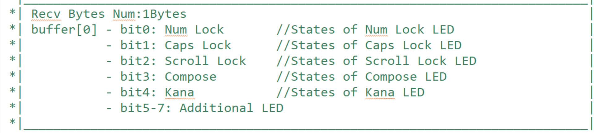

# Bad-USB

This project is my undergraduate graduation project, mainly completing:

- **USB firmware design**
- **development and selection of attack chain**
- **countermeasures against this attack**.

此项目为我的本科毕业设计，主要完成了**USB固件设计**，**攻击链的制定与选取**，还有**针对此攻击的应对措施**。


## USB_Firmware_Design

> 固件平台：NUCLEO-F042K6开发板
>
> - `MCU`: F042K6T6
>   - `Frequency`: 48MHz
>   - `SRAM`: 6KB
>   - `Flash`: 32KB
> - `Pin count`：32
>
> IDE：STM32CubeIDE+STM32CubeProgrammer

### 1. 建立工程：

新建STM32工程`KeyBoard`：

#### ioc配置

- 在`System Core->SYS`中选择`Debug Serial Wire`

- 在`Connectivity->USB`中选择`Device(FS)`，即全速12MB/s模式

- 在`Middleware and Software Packs->USB_Device`的`Class For FS IP`中选择`Custom`模式，进行自定义配置USB设备

  同时修改设备描述字符串，如下图所示：

#### 调试接口

- 查看该开发板的硬件电路图：  

  > 参考：[MB1180.pdf](./README.assets/Nucleo-F042K6原理图及PCB/MB1180.pdf) 
  >
  > 可以看到`PB3`引脚连接一个板载LED灯，在拉高`PB3`引脚后使得连接的`LD3`绿灯点亮

- 在`KeyBoard.ioc`文件中选取`PB3`作为`GPIO_output`，便于观察烧录进去的程序是否在运行与调试：

  将`System Core->GPIO`中设置该引脚电平拉高，并添加`Tag`:LED_Green

  

#### 生成示例代码

在`Project Manager`的`Code Generator`中进行如下配置方面后续对ioc的修改与重新生成代码：

#### 初始化配置


### 2. 键盘设备描述符的生成：

#### HID设备描述符概述

> HID设备描述符是主从设备传输数据接口的规范，它为键盘这一人机交互设备提供了一个标准化的描述方式。该描述符允许不同厂商生产的键盘设备在保持各自特色和功能的同时，能够被操作系统以统一的方式识别和管理。这种设备的抽象和标准化是现代操作系统能够支持广泛硬件设备的基础。
>
> 1. **设备能力的自我描述**：HID键盘设备描述符使得键盘能够自我描述其功能和性能特性，如键位布局、特殊按键功能等。这种自我描述能力极大地简化了操作系统或应用程序对设备的支持流程，实现了“即插即用”的体验，减少了用户配置的需要。
> 2. **数据交换协议的定义**：设备描述符中包含了设备与主机之间数据交换的协议规范，包括数据报文的格式、长度和传输方式等。这确保了从键盘到主机的数据传输是高效和准确的，无论是字符输入还是特殊功能键的操作。
> 3. **交互复杂性的管理**：随着键盘设备功能的增加，如多媒体控制、宏命令等，HID键盘设备描述符为这些复杂交互提供了框架和语言，支持更丰富的用户交互方式。这不仅增强了用户体验，也为软件开发人员提供了更多控制和创新的可能性。
> 4. **跨平台兼容性的促进**：通过遵循HID标准，键盘设备描述符有助于实现设备的跨平台兼容性。这意味着同一设备可以在不同的操作系统和硬件平台上使用，而无需为每个平台开发和维护特定的驱动程序，从而促进了开放标准和技术的普及。

对于HID键盘设备而言，描述符定义了不同按键在USB设备发送给主机设备的数据包中的描述位置，同时也规定了主机设备返回给HID键盘设备的数据包格式与规范。简而言之：

- 描述符定义了不同(组合)按键的发送数据包格式
- 描述符定义了返回数据包的格式与内容，这通常是主机输入状态对应键盘LED灯状态的回显，如：
  - 大写LED灯状态，对应主机是否处于大写状态
  - 数字键盘锁LED灯状态，对应主机数字键盘锁是否打开
  - 等等

#### HID设备描述符生成过程

报告描述符较为复杂，可使用工具生成，usb-if 官网提供了相应的工具，可在 https://www.usb.org/hid 最下面的 Tools 中找到相应的软件，例如 Waratah，这个软件使用的上手难度较高，这里选择下述生成工具：

点击[Deprecated Links and Tools](https://usb.org/deprecated-links-and-tools)链接，使用HID Descriptor Tool 工具 [**MSDEV**](https://usb.org/document-library/hid-descriptor-tool)。

> 压缩包如下： [dt2_4.zip](./README.assets/dt2_4.zip) 

在本工程中，选择生成一份**全键无冲**的HID键盘设备描述符： [Desc1.hid](README.assets/Desc1.hid) 

> **关于全键无冲和六键无冲：**
>
> 在USB-IF给出的标准键盘示例框架中：
>
> - 第一个字节表达八个控制按键 (Shift / Control / Alt / GUI，左右各四个，GUI 在 Windows 操作系统下是 Windows 键，Linux 下是 Super 键，Mac 下为 Command 键) 的状态值，每个比特代表一个按键的状态。
> - 第二个字节为保留字节，恒定为0，原因暂不清楚，哪怕是自定义的键盘描述符，也不能拿掉这个字节。
> - 剩下六个字节存储六个键值，也就是说，标准的键盘能够一次发送 8 + 6 = 14 个按键，这也是平常所说的六键无冲。
>
> 这样的六键无冲(6-Key Rollover, 6KRO)的键盘在BIOS环境下是可以使用的。这是因为6KRO是键盘硬件本身支持的特性，它允许用户同时按下多达六个键（不包括一些特定的修饰键如Ctrl、Alt、Shift等，这些键通常被设计为可以和其他键同时按下而不计入最大键数限制），而键盘能够准确注册和传输这些按键事件给计算机系统。
>
> BIOS环境，作为计算机启动过程中的基本输入输出系统，与操作系统级别的软件环境不同，它直接与硬件交互。当你在BIOS设置界面中使用键盘时，键盘与BIOS的交互并不依赖于操作系统驱动程序，而是基于更底层的硬件通信协议。因此，只要键盘硬件支持6KRO，且BIOS具有处理这种输入方式的能力，六键无冲在BIOS下就是可以正常使用的。
>
> 然而，需要注意的是，BIOS的具体实现和键盘的硬件设计可能会影响这一功能的实际表现。一些老旧的BIOS或键盘可能不支持或不完全支持6KRO功能。随着UEFI（统一可扩展固件接口）的普及，现代计算机系统提供了更好的硬件支持和更高的兼容性，使得6KRO和更高级的N键无冲（NKRO）技术得到了更广泛的应用和支持。


该键盘描述符的含义如下：

- 发送数据包：
- 接收数据包：

#### 修改工程文件

在`Custom Human Interface Device Class(HID)`的框架中，用户自定义设备描述符在`usbd_custom_hid_if.c`文件中。

在`__ALIGN_BEGIN static uint8_t CUSTOM_HID_ReportDesc_FS[USBD_CUSTOM_HID_REPORT_DESC_SIZE] __ALIGN_END =`中，

将自定义键盘描述符写入即可


### 3. 模拟键盘键入过程

对于一次键盘键入过程，其实可分为键的按下与释放两个过程，对于键的按下与释放，在HID设备与主机交互的过程中会发送两种不同的数据包。

以下对两个子过程分别分析：

- 键的按下：

  在上一步生成的HID设备描述符中，已经规定了发送时数据包的格式与内容。

  在该自定义的设备描述符中，每次键的按下过程需要向主机发送15字节的数据，这十五字节数据共有120位，除第1字节(从0开始)按照HID规范应全为0外，其余的每一位都表示一个按键是否按下。

  由于此数据包可一次性发送所有按键的状态，因此这个自定义设备全键无冲，也就是说一次性发送的数据包可模拟全部键的按下。

- 键的松开：

  其实按键松开的本质就是发送的数据包里每一个键对应位均为0，也就是未按下任何键。

  因此模拟键的松开就是发送一个全0的15字节的数据包。

#### 映射表设计：

> 本过程旨在设计从`ASCII码字符`到`对应的15Bytes发送数据包`的映射表，方便用户对发送描述符的操作与管理：
>
> ASCII码的常用可见字符在0~127之间，因此我们设置一个至少128个元素的映射表，对于一些键盘中会用到的特殊功能键，我们在数组的128元素之后另行设计。
>
> 对于每一个字符到其数据包的映射，我们只需要知道为了输入此字符需要按下哪些键即可，然后在发送的15字节数据包中令这些键对应的位为1即可。
>
> 在英文状态输入下，小写字符a-z只需要单独按下键盘上的a-z键即可；对于大写字符A-Z，我们需要同时按下shift键+对应的字母键，其余字符同理。

因此我们设计一个`uint8_t`类型的数组：

- 数组的**高四位**表示的数指明在该键盘描述符中该字符状态表示位位于这个15字节数据包中的第几个字节(从0开始计数：0-14)
- 数组的低四位中：
  - 最高位表示在模拟输入该字符时是否需要按下`shift`键
  - 剩下的三位表示的数指明该字符状态表示位位于这个15字节数据包中对应字节的第几位(同样从0开始计数：0-7)

如下图所示：

构造出的映射表如下：

```c
uint8_t map[129]={
  		0x00, 0x00, 0x00, 0x00, 0x00, 0x00, 0x00, 0x00,
  		0x00, 0x00, 0x64, 0x00, 0x00, 0x64, 0x00, 0x00,
  		0x00, 0x00, 0x00, 0x00, 0x00, 0x00, 0x00, 0x00,
  		0x00, 0x00, 0x00, 0x00, 0x00, 0x00, 0x00, 0x00,
  		0x70, 0x5a, 0x88, 0x5c, 0x5d, 0x5e, 0x68, 0x80,
  		0x6a, 0x6b, 0x69, 0x7a, 0x82, 0x71, 0x83, 0x84,
  		0x63, 0x52, 0x53, 0x54, 0x55, 0x56, 0x57, 0x60,
  		0x61, 0x62, 0x7f, 0x77, 0x8a, 0x72, 0x8b, 0x8c,
  		0x5b, 0x28, 0x29, 0x2a, 0x2b, 0x2c, 0x2d, 0x2e,
  		0x2f, 0x38, 0x39, 0x3a, 0x3b, 0x3c, 0x3d, 0x3e,
  		0x3f, 0x48, 0x49, 0x4a, 0x4b, 0x4c, 0x4d, 0x4e,
  		0x4f, 0x58, 0x59, 0x73, 0x75, 0x74, 0x5f, 0x79,
  		0x81, 0x20, 0x21, 0x22, 0x23, 0x24, 0x25, 0x26,
  		0x27, 0x30, 0x31, 0x32, 0x33, 0x34, 0x35, 0x36,
  		0x37, 0x40, 0x41, 0x42, 0x43, 0x44, 0x45, 0x46,
  		0x47, 0x50, 0x51, 0x7b, 0x7d, 0x7c, 0x89, 0xb0,
  		0x85,     //ASCII[128]:Capslock
  		0x66,     //ASCII[129]:Backspace
  };
```

转换函数如下：

```c
void Get_Descriptor(uint8_t ascii){
	memset(sent_buffer, 0x00, sizeof(uint8_t)*USBD_CUSTOMHID_OUTREPORT_BUF_SIZE);
	uint8_t pos = Map[ascii];
	sent_buffer[(uint8_t)(pos>>4)] |= (1<<((uint8_t)(pos&0x07)));
	if((pos&0x08) == 8)
		sent_buffer[0] |= 0x02;
}
```

#### 输入输出函数设计：

```c
//按键按下子过程
void SimulateKeyPress(uint8_t ascii){
    //get key:ascii Descriptor
    Get_Descriptor(ascii);
    //Sent Descriptor report
    USBD_CUSTOM_HID_SendReport(&hUsbDeviceFS, sent_buffer, USBD_CUSTOMHID_OUTREPORT_BUF_SIZE);
}
//按键松开子过程
void SimulateKeyRelease(){
    //set 0
	memset(sent_buffer, 0x00, sizeof(uint8_t)*USBD_CUSTOMHID_OUTREPORT_BUF_SIZE);
    //Sent Descriptor report
	USBD_CUSTOM_HID_SendReport(&hUsbDeviceFS, sent_buffer, USBD_CUSTOMHID_OUTREPORT_BUF_SIZE);
}
//按键总过程
void SimulateKeyStroke(uint8_t ascii){
	SimulateKeyPress(ascii);
    HAL_Delay(StrokeSlot); //Wait StrokeSlot time
    SimulateKeyRelease();
    HAL_Delay(StrokeSlot); //Wait StrokeSlot time
}
//输出目标字符串
void SimulateKeyStrokes(char *str, int len, int *cntNow){
    for(; *cntNow < len; (*cntNow)++){
    	SimulateKeyStroke(str[*cntNow]);
    }
}
```

### 4. 提高注入字符串的准确率

为了尽可能保证攻击注入字符的一次性成功，经过分析设计，采用以下方案：

- 攻击时确保主机输入环境处于大写状态：

  这种情况下可以屏蔽不同国家语言输入状态的干扰，保证输出英文半角字符。

- 通过**输入前后检查**和**触发中断陷阱**方法保证主机不受外部调整输入法干扰

  这个过程本来的想法是想保证HID输入设备不受任何其他键盘的输入影响，但由于这个过程需要保证一台USB设备发送数据，所有USB设备都能收到主机反馈，这样的反馈对于键盘设备而言只有LED指示灯的状态，也就是说键盘正常键入的英文字符后主机不会通过USB总线向其他设备发送反馈数据包。

#### 映射转换

上面给出的映射表只是英文状态下的映射表，现在对这个映射表修改为大写状态下的映射表：

在大写模式下，输出小写就是`shift`+`对应字母键`，因此我们只需要转换ASCII码中大小写字符的映射即可：

转换函数如下：

```c
void Convert2CapsMap(uint8_t LowerCaseMap[MapLen]){
	for(uint8_t cnt = 'A'; cnt <= 'Z'; cnt++){
		LowerCaseMap[cnt] &= 0xf7;
		LowerCaseMap[cnt+'a'-'A'] |= 0x08;
	}
}
```

#### 屏蔽外部干扰

##### 设计中断陷阱

由于STM32没有异常陷阱机制，只有一系列外部中断调用方法，在这里选取定时器中断处理外部干扰。

- 在`ioc`文件中开启`TIM2`定时器，如下图所示：

  定时器周期设为50ms.

- 在STM32库给出的回调方法中，在`usbd_custom_hid_if.c`中给出了HID设备在接收主机发送的数据包后的回调处理函数`CUSTOM_HID_OutEvent_FS`。在此函数中我们在收集到主机发送的LED状态信息后，对主机现有大小写状态进行判断并采取相应的措施。

  我的思路是：

  - 在检测到主机变为小写状态后，直接触发定时器溢出中断；
  - 在触发中断后第一次进入定时器中断回调函数时，模拟大写键按下操作发送大写键描述数据包
  - 在继续执行`usbd_custom_hid_if.c`初始化定时器中断并开始定时器计时，在50ms后触发定时器溢出中断第二次进入定时器中断回调函数
  - 在第二次进入定时器中断回调函数后模拟大写键释放操作
  - 第三次溢出进入定时器中断是执行关闭定时器操作

##### 输入前后检查

是否正确输入字符的关键在于执行键盘按下即发送按键描述数据包时主机环境的正确性，因此，为尽可能保证正确，我们在发送前和发送后对主机大小写环境进行检测，若两者之一不是大写环境则进行回退操作。

- 输入前：空循环判断是否为大写环境
- 输入后：设置全局变量对输入后环境进行描述若不为大写环境则进行回退操作

#### 修改补充自定义函数

##### 自定义中断陷阱函数

```c
//In main.c
void InterruptTrap(int *InterruptFlag){
	if(*InterruptFlag == 1){
		*InterruptFlag = 0;
		//Trigger timer interrupt immediately by setting the value of the register
		TIM2->EGR |= TIM_EGR_UG;
		//Second entry interrupt
		MX_TIM2_Init();
		HAL_TIM_Base_Start_IT(&htim2);
	}
}
```

##### 自定义定时器中断回调函数

```c
//In main.c
void HAL_TIM_PeriodElapsedCallback(TIM_HandleTypeDef *htim){
	if(htim == &htim2){
		if(InterruptCnt == 0){
			Get_Descriptor(128);
			USBD_CUSTOM_HID_SendReport(&hUsbDeviceFS, sent_buffer, USBD_CUSTOMHID_OUTREPORT_BUF_SIZE);
//			HAL_GPIO_WritePin(GPIOB, GPIO_PIN_3, GPIO_PIN_SET);
		}else if(InterruptCnt == 1){
			SimulateKeyRelease();
			if((recv_buffer[0]&0x02) != 0x02)
				InterruptCnt = -1;
//			HAL_GPIO_WritePin(GPIOB, GPIO_PIN_3, GPIO_PIN_RESET);
		}else{
			TIM2->CR1 &= ~TIM_CR1_CEN;
		}
		InterruptCnt = (InterruptCnt+1)%3;
	}
}
```

##### 修改输入输出函数

```c
//In main.c
//按键按下子过程
void SimulateKeyPress(uint8_t ascii){
    //get key:ascii Descriptor
    Get_Descriptor(ascii);
    //Ensure that this instruction is executed in uppercase environment.
//    while((recv_buffer[0]&0x02) != 0x02)
//    	HAL_Delay(1);
    //Sent Descriptor report
    USBD_CUSTOM_HID_SendReport(&hUsbDeviceFS, sent_buffer, USBD_CUSTOMHID_OUTREPORT_BUF_SIZE);
    if((recv_buffer[0]&0x02) != 0x02)
    	NeedRollBack = 1;
}
//按键松开子过程
void SimulateKeyRelease(){
    //set 0
	memset(sent_buffer, 0x00, sizeof(uint8_t)*USBD_CUSTOMHID_OUTREPORT_BUF_SIZE);
    //Sent Descriptor report
	USBD_CUSTOM_HID_SendReport(&hUsbDeviceFS, sent_buffer, USBD_CUSTOMHID_OUTREPORT_BUF_SIZE);
}
//按键总过程
void SimulateKeyStroke(uint8_t ascii){
	SimulateKeyPress(ascii);
    HAL_Delay(StrokeSlot); //Wait StrokeSlot time
    SimulateKeyRelease();
    HAL_Delay(StrokeSlot); //Wait StrokeSlot time
}
//输出目标字符串
void SimulateKeyStrokes(char *str, int len, int *cntNow){
    for(; *cntNow < len; (*cntNow)++){
    	//Ensure func SimulateKeyStroke is executed in uppercase environment.
    	if((recv_buffer[0]&0x02) != 0x02){
    		SimulateKeyStroke(128);
    	}
    	SimulateKeyStroke(str[*cntNow]);
    	//Determine if RollBack is necessary
    	if(NeedRollBack == 1){
    		NeedRollBack = 0;
    		(*cntNow)--;
    		SimulateKeyStroke(129);
    	}
    }
}
//输出接收数据包(1Byte)检测
void PrintRecvBuf(uint8_t Recv_Buf[USBD_CUSTOMHID_INREPORT_BUF_SIZE]){
	HAL_Delay(StrokeSlot);
	for(int i = 0; i < USBD_CUSTOMHID_INREPORT_BUF_SIZE; i++){
		for(int j = 0; j < 8; j++){
			SimulateKeyStroke(((Recv_Buf[i]&(uint8_t)(0x01<<j))>>j)+'0');
		}
	}
	SimulateKeyStroke('\n');
}
//设计中断后弃用函数
void InitKeyboardStatus(){//Convert keyboard to uppercase mode
	SimulateKeyStroke(128);
	HAL_Delay(StrokeSlot);
	if((recv_buffer[0]&0x02) != 0x02){
		SimulateKeyStroke(128);
		PrintRecvBuf(recv_buffer);  //print Keyboard LED Status
	}
}
```

##### 修改PCD文件

发送数据包的函数调用过程如下：

`USBD_CUSTOM_HID_SendReport`$\Rightarrow$`USBD_LL_Transmit`$\Rightarrow$`HAL_PCD_EP_Transmit`$\Rightarrow$==`HAL_PCD_EP_Transmit`==

我们将`HAL_PCD_EP_Transmit`函数(位于`stm32f0xx_hal_pcd.c`文件中)作如下修改，同时添加**外部声明**与**宏定义**：

```c
//In stm32f0xx_hal_pcd.c:
//(1).Add these external declarations at the beginning of this file:
#define USBD_CUSTOMHID_INREPORT_BUF_SIZE 1
extern uint8_t recv_buffer[USBD_CUSTOMHID_INREPORT_BUF_SIZE];
extern int InterruptFlag;
extern int NeedRollBack;
//(2).In function: HAL_StatusTypeDef HAL_PCD_EP_Transmit();
//Add following codes **before** USB_EPStartXfer function:
    //Determine whether to generate an interrupt:
    if((recv_buffer[0]&0x02) != 0x02)
        InterruptFlag = 1;
//Add following codes **after** USB_EPStartXfer function:
    //Output test to choose whether to RollBack:
    if((recv_buffer[0]&0x02) != 0x02)
        NeedRollBack = 1;
```

